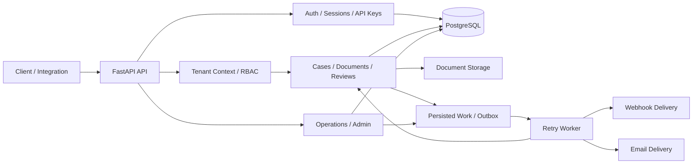

# CaseFlow

[](https://github.com/MaciejZiel/caseflow/actions/workflows/ci.yml)

CaseFlow is a production-style, multi-tenant B2B backend for case and document processing.

It is built as a modular monolith with **FastAPI**, **SQLAlchemy**, **Alembic**, and **PostgreSQL**, with a focus on the parts that usually separate a demo API from a maintainable backend system:

- tenant isolation
- authentication and session lifecycle
- RBAC and API keys
- explicit document workflows
- auditability
- reliable background processing
- webhook and email delivery
- operational tooling
- automated tests and CI

## Why this project exists

CaseFlow is not meant to be another CRUD demo.

The project explores how a backend behaves once real operational concerns appear: multiple organizations using the same system, users with different roles, document state transitions, asynchronous work, retries, audit history, integrations, platform administration, and failure recovery.

The main goal is to keep those concerns explicit and understandable instead of spreading them across unrelated endpoints and ad-hoc background tasks.

## Architecture



The application uses a **shared-schema multi-tenant model**. Tenant-aware data is scoped by `organization_id`, while authorization rules are enforced through organization membership and RBAC.

Operational side effects such as document processing, webhook delivery, email delivery, retries, and notification digests can be handled through persisted work records and the background worker.

## Core capabilities

### Multi-tenancy and access control

- organization registration with the first owner account
- organization membership and invitation flow
- tenant-scoped cases and documents
- RBAC across organizations, members, cases, documents, and webhooks
- organization-scoped API keys for system-to-system integrations
- dedicated read-only integration endpoints

### Authentication and sessions

- JWT login and refresh flow
- persisted authentication sessions
- refresh rotation
- logout and logout-all
- per-session revocation
- device naming
- last-seen activity tracking
- password reset flow

### Case and document workflow

- tenant-scoped case CRUD and archive flow
- case comments
- document uploads and versioning
- configurable inline or worker-based document processing
- approve / reject review workflow
- case status transitions
- retry support for failed processing jobs
- audit logs for cases and documents

### Webhooks and email delivery

- webhook endpoint management
- event subscriptions
- HMAC-signed webhook delivery
- delivery history
- retry and replay support
- persisted outbound email outbox
- local email sink for development
- SMTP adapter for real delivery

### Reporting and operations

- case summary reporting
- case search
- CSV exports
- organization operations summary
- failure inspection
- retry-due maintenance endpoints
- retention preview and cleanup flows

### Platform administration

- platform overview
- anomaly detection
- risk reporting
- tenant activity feed
- tenant suspension and reactivation
- review queue with assignees, comments, and due dates
- risk snapshots
- workload and attention views
- automatic review opening
- automatic assignment
- overdue escalation
- operator notifications
- notification digests and preferences
- bulk lifecycle controls

## Engineering decisions

A large part of the project is about keeping backend behavior predictable as the system grows.

### Shared-schema multi-tenancy

Tenant data is scoped explicitly by `organization_id`.

This keeps the data model simple while making tenant boundaries visible in queries and authorization logic.

### Persisted auth sessions

Access tokens are short-lived JWTs, but they are tied to persisted sessions.

That allows immediate logout, session revocation, device metadata, and activity tracking without relying only on token expiration.

### Scoped API keys

Organization API keys are hashed at rest and exposed through dedicated integration endpoints instead of granting broad write access to the main API.

### Explicit workflow state

Documents move through controlled review and processing flows rather than arbitrary state updates.

Audit records preserve the history of important actions.

### One retry path

Organization maintenance endpoints, platform-wide retry operations, and the worker reuse the same persisted work and retry machinery.

That avoids creating multiple execution paths for the same failure handling logic.

### Webhook replay preserves history

Replaying a webhook creates a new delivery record instead of mutating historical delivery state.

This keeps the original delivery history intact.

### Previewable maintenance operations

Retention cleanup and several platform administration actions expose preview flows before execution.

That makes destructive or bulk operations easier to inspect and reason about.

### Reused operational data

Risk reporting, anomaly detection, review queues, workload views, escalation, and notification flows reuse the same underlying tenant and review state instead of introducing separate parallel systems.

## Selected API surface

The project exposes a larger API, but these endpoints represent the main system areas:

```text
POST   /api/v1/auth/register
POST   /api/v1/auth/login
POST   /api/v1/auth/refresh
GET    /api/v1/auth/sessions

POST   /api/v1/api-keys
GET    /api/v1/api-keys

POST   /api/v1/cases
POST   /api/v1/cases/{case_id}/documents
GET    /api/v1/cases/{case_id}/audit-log

POST   /api/v1/documents/{document_id}/approve
POST   /api/v1/documents/{document_id}/reject
POST   /api/v1/documents/{document_id}/jobs/{job_id}/retry

POST   /api/v1/webhooks/endpoints
GET    /api/v1/webhooks/deliveries
POST   /api/v1/webhooks/deliveries/{delivery_id}/replay

GET    /api/v1/operations/summary
GET    /api/v1/operations/failures

GET    /api/v1/admin/overview
GET    /api/v1/admin/risk-report
GET    /api/v1/admin/reviews
GET    /api/v1/admin/reviews/attention-queue

GET    /health
GET    /ready
GET    /metrics
```

## Local development

### 1. Install dependencies

Create or reuse a virtual environment and run:

```bash
make install
```

### 2. Configure the environment

Copy the example configuration:

```bash
cp .env.example .env
```

Adjust values if needed.

### 3. Apply migrations

```bash
make migrate
```

### 4. Start the API

```bash
make run
```

### 5. Optional: seed demo data

```bash
make seed-demo
```

The demo dataset includes:

- one demo organization: `demo-claims`
- owner, admin, reviewer, and member accounts
- approved, rejected, failed-processing, and archived cases
- multi-version document history
- comments
- an inactive webhook endpoint

### 6. Optional: run the worker

```bash
make retry-worker
```

For a single worker cycle:

```bash
make retry-worker-once
```

## Worker modes

CaseFlow can run synchronously for a simple local setup or defer work to the background worker.

```text
DOCUMENT_PROCESSING_MODE=inline|worker
WEBHOOK_DELIVERY_MODE=sync|worker
EMAIL_DELIVERY_MODE=sync|worker
```

When worker mode is enabled, work is persisted first and processed through the retry worker.

The same worker cycle can also process platform admin notification digests.

## Email delivery

Invitation and password reset emails are written through a persisted outbox.

Available backends:

```text
EMAIL_DELIVERY_BACKEND=local
EMAIL_DELIVERY_BACKEND=smtp
```

The local backend writes JSON payloads to the configured local sink path.

SMTP settings can be used for real delivery.

## Docker

Start the local stack with:

```bash
make docker-up
```

The Docker setup includes:

- FastAPI application
- PostgreSQL 17
- migrations on application startup
- persistent storage for uploaded documents

Stop the stack and remove data volumes with:

```bash
make docker-down
```

## Testing and CI

Run the local verification baseline with:

```bash
make lint
make test
```

The project also verifies:

- Alembic migrations on a clean database
- retry worker execution
- PostgreSQL migrations in GitHub Actions

Integration tests cover areas including:

- authentication and session lifecycle
- password reset
- invitations and membership
- tenant isolation
- API key management
- case reporting and search
- document processing and review
- audit logs
- webhook delivery, retry, and replay
- email outbox delivery
- operational maintenance
- platform administration
- anomaly and risk reporting
- review queue workflows
- retention operations
- demo data seeding

## Operational hardening

The project includes:

- health and readiness endpoints
- metrics
- structured logging
- security headers
- trusted host filtering
- configurable CORS allowlists
- opt-in proxy header trust
- Docker-based local environment
- CI verification

Before exposing the API through a public ingress, configure trusted hosts and allowed origins appropriately and enable proxy header trust only behind a trusted reverse proxy.

## Project structure

```text
.
├── app/                # application code
├── alembic/            # database migrations
├── docs/               # additional documentation
├── scripts/            # worker, demo and maintenance scripts
├── tests/              # integration tests
├── .github/workflows/  # CI
├── Dockerfile
├── compose.yml
├── Makefile
└── pyproject.toml
```

## Current limitations / next steps

High-value next steps currently include:

- an internal admin UI on top of the platform review queue APIs
- notification quiet hours or routing rules for different platform admin roles

## Tech stack

**Backend:** FastAPI, SQLAlchemy, Alembic  
**Database:** PostgreSQL  
**Auth:** JWT + persisted sessions + organization API keys  
**Async / delivery:** persisted worker queues, webhook delivery, email outbox  
**Operations:** Docker, metrics, structured logging, CI  
**Testing:** integration tests + migration verification

## License

Released under the [MIT License](LICENSE).
