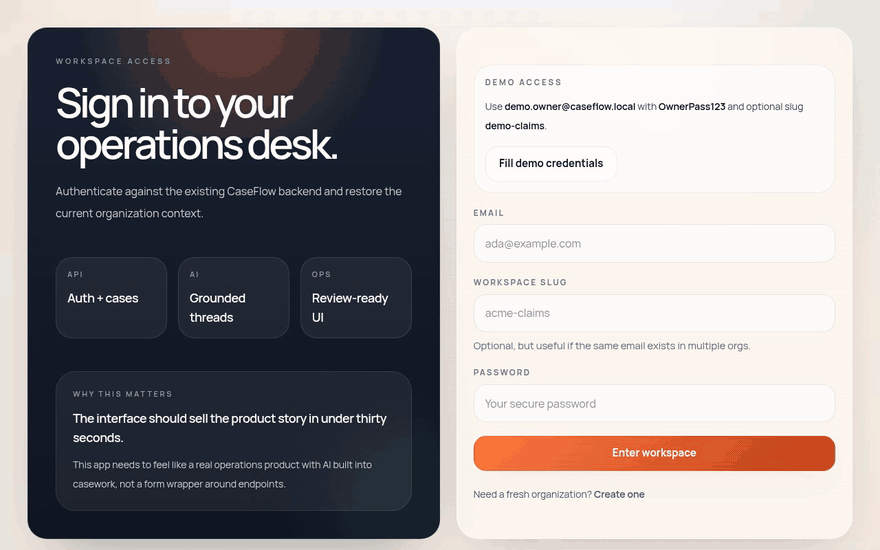
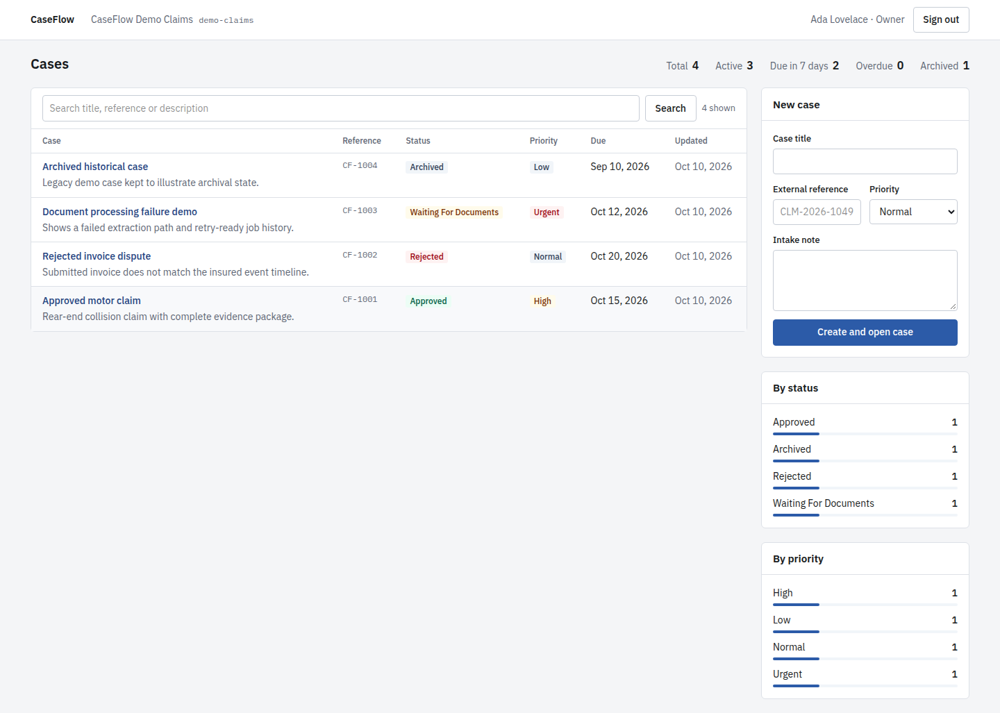
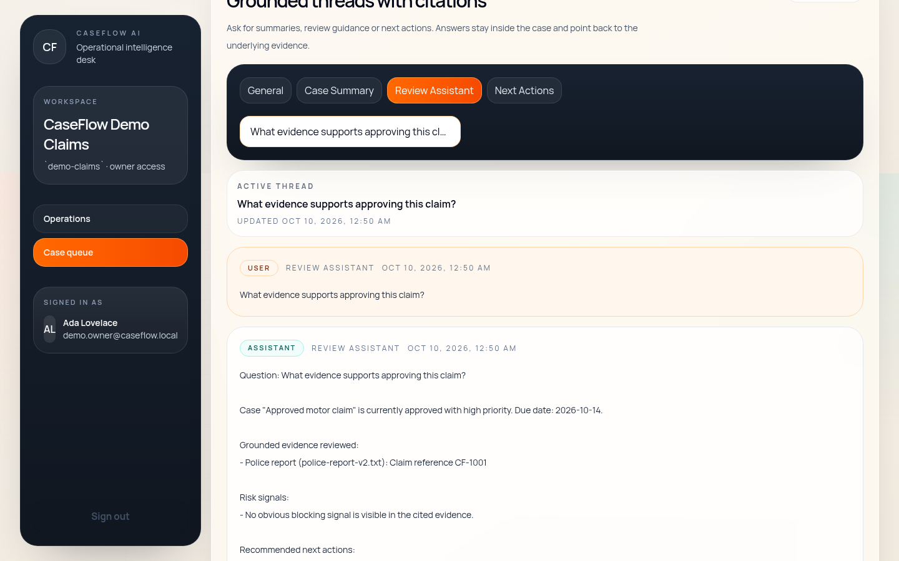
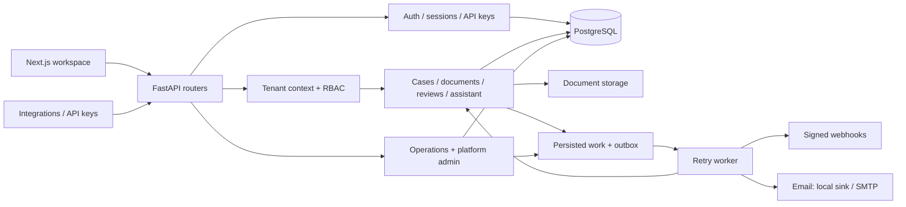

# CaseFlow

**A multi-tenant B2B backend for case and document workflows — tenant isolation, RBAC, persisted sessions, audit trails, retryable background work and signed webhooks — with a Next.js workspace on top.**

[](https://github.com/MaciejZiel/caseflow/actions/workflows/ci.yml)
[](https://github.com/MaciejZiel/caseflow/actions/workflows/codeql.yml)
[](LICENSE)


Live demo: coming soon — deploy with the button below

[](https://render.com/deploy?repo=https://github.com/MaciejZiel/caseflow)



## What it does

- **Isolates tenants in one shared schema.** Every tenant-owned row carries `organization_id`; organization membership and role-based policies decide who can read, write, review or retry.
- **Runs an explicit document workflow.** Uploads are versioned, processed inline or by a worker, and approved or rejected through a review flow; every important action lands in an audit log.
- **Handles side effects reliably.** Document processing, HMAC-signed webhooks and outbound email go through persisted work records with retries and replay, driven by one retry worker.
- **Gives platform operators tooling.** Risk and anomaly reports, a review queue with assignees and due dates, escalation, notification digests, previewable retention cleanup and tenant suspension.
- **Answers questions about a case.** A case-scoped assistant ranks the case's documents and latest comment against the question and returns a structured answer with stored citations. It is deterministic (keyword scoring and templates) — no external LLM is called.

| Operations dashboard | Case assistant with citations |
| --- | --- |
|  |  |

## Architecture



The code is a modular monolith: `app/api` (HTTP layer, schemas, dependencies), `app/application` (services that implement use cases), `app/domain` (models and access policies) and `app/infrastructure` (database, storage, security, delivery adapters). The API exposes 96 operations under `/api/v1` plus `/health`, `/ready` and `/metrics`; the OpenAPI UI is at `/docs`.

## Tech stack

| Area | Tools |
| --- | --- |
| API | Python 3.13, FastAPI, Pydantic v2, pydantic-settings |
| Data | PostgreSQL 17, SQLAlchemy 2.0, Alembic (19 migrations) |
| Auth | PyJWT access tokens bound to persisted sessions, hashed organization API keys |
| Background work | Persisted job / webhook / email records, retry worker (`scripts/run_retry_worker.py`) |
| Observability | structlog JSON logs, Prometheus metrics, request IDs, health and readiness probes |
| Frontend | Next.js 16 (App Router), React 19, TypeScript, Tailwind CSS v4 |
| Tooling | pytest + pytest-cov, Ruff, Playwright (end-to-end), Docker Compose, GitHub Actions |

## Quick start

### Docker (API + frontend + Postgres)

```bash
git clone https://github.com/MaciejZiel/caseflow.git && cd caseflow
docker compose up -d --build   # API on :8000, frontend on :3000, Postgres on :5432
make docker-seed-demo          # recreates the demo-claims workspace inside the api container
```

Open http://127.0.0.1:3000/auth/login and click **Fill demo credentials**, or browse the API at http://127.0.0.1:8000/docs. Stop and remove the data with `docker compose down -v`.

Demo accounts (organization slug `demo-claims`):

| Role | Email | Password |
| --- | --- | --- |
| owner | `demo.owner@caseflow.local` | `OwnerPass123` |
| admin | `demo.admin@caseflow.local` | `AdminPass123` |
| reviewer | `demo.reviewer@caseflow.local` | `ReviewerPass123` |
| member | `demo.member@caseflow.local` | `MemberPass123` |

The dataset includes approved, rejected, failed-processing and archived cases, multi-version documents, comments and an inactive webhook endpoint.

### Local Python environment

Requires Python 3.13 and a running PostgreSQL (for example the `db` service from `compose.yml`).

```bash
python3.13 -m venv .venv
make install            # pip install -e ".[dev]"
cp .env.example .env    # adjust DATABASE_URL / SECRET_KEY if needed
make migrate
make seed-demo          # optional
make run                # uvicorn with reload on :8000
```

Frontend: `make frontend-install && make frontend-dev` (reads `NEXT_PUBLIC_API_BASE_URL`, see `frontend/.env.example`). The API must allow the frontend origin through `CORS_ALLOWED_ORIGINS` (comma-separated or a JSON list).

### Worker modes

Side effects run synchronously by default. Switch any of them to the worker:

```text
DOCUMENT_PROCESSING_MODE=inline|worker
WEBHOOK_DELIVERY_MODE=sync|worker
EMAIL_DELIVERY_MODE=sync|worker
EMAIL_DELIVERY_BACKEND=local|smtp
```

Then run `make retry-worker` (loop) or `make retry-worker-once` (single cycle). The same cycle also sends platform admin notification digests.

## Tests

```bash
make lint
make test                                # 148 tests
.venv/bin/python -m pytest --cov=app     # 100% line coverage of app/
```

- **148 pytest tests** (103 integration, 45 unit) with **100% line coverage** of the `app` package. Integration tests call the real FastAPI app through an httpx ASGI client against SQLite and cover auth and session lifecycle, tenant isolation, RBAC, document review, webhooks (delivery, retry, replay), the email outbox, the retry worker, platform admin flows and demo seeding.
- **CI** (GitHub Actions) runs Ruff lint and format checks, the full suite and `alembic upgrade head` against a PostgreSQL 17 service container on every push and pull request. CodeQL scans the Python and TypeScript code on every push to `master`, on pull requests and weekly; Dependabot proposes grouped weekly dependency updates.
- **End-to-end:** `make frontend-e2e` runs 2 Playwright scenarios (register and sign in; create a case, upload a document and get an assistant answer) against a throwaway API. Frontend lint and build: `make frontend-lint`, `make frontend-build`.

## Key technical decisions

**Shared schema instead of schema- or database-per-tenant.** One schema with an explicit `organization_id` keeps migrations, reporting and platform-wide admin queries simple. The cost is that every query must be scoped correctly, so tenant boundaries are enforced in the service layer and covered by cross-tenant isolation tests rather than left to convention.

**Short-lived JWTs bound to persisted sessions.** A stateless JWT alone cannot be revoked. Each access token references a stored session, which enables refresh-token rotation, logout-all, per-device revocation and last-seen tracking, at the price of a session lookup per request (activity writes are throttled by `AUTH_SESSION_ACTIVITY_UPDATE_INTERVAL_SECONDS`).

**Persisted work records instead of a message broker.** Jobs, webhook deliveries and emails are rows in PostgreSQL that the worker picks up and retries with backoff. That gives transactional consistency with the business change, inspectable failure history and one retry path shared by the worker, tenant maintenance endpoints and platform admin, without running Redis or RabbitMQ. The trade-off is lower throughput than a dedicated queue — acceptable for back-office workloads.

**History is append-only where it matters.** Replaying a webhook creates a new delivery instead of mutating the old one, document changes create new versions, and destructive maintenance (retention cleanup, bulk lifecycle actions) has a preview step. Audit questions stay answerable after the fact.

<details>
<summary>More detail: capability list and selected endpoints</summary>

**Multi-tenancy and access control** — organization registration with the first owner, invitations and membership, tenant-scoped cases and documents, RBAC across organizations, members, cases, documents and webhooks, organization API keys for read-only integration endpoints.

**Authentication** — JWT login and refresh with rotation, persisted sessions, logout and logout-all, per-session revocation, device naming, last-seen tracking, password reset.

**Cases and documents** — case CRUD and archive, comments, document uploads and versioning, inline or worker processing, approve / reject review, status transitions, retries for failed processing, audit logs.

**Webhooks and email** — endpoint management and event subscriptions, HMAC-signed delivery, delivery history, retry and replay, persisted email outbox with a local sink and an SMTP adapter.

**Reporting and operations** — case summary reporting and search, CSV exports, organization operations summary, failure inspection, retry-due maintenance, retention preview and cleanup.

**Platform administration** — overview, anomaly detection, risk reporting and snapshots, tenant activity feed, suspension and reactivation, review queue with assignees, comments and due dates, workload and attention views, automatic review opening and assignment, overdue escalation, operator notifications, digests and preferences, bulk lifecycle controls.

**Operational hardening** — security headers, trusted-host filtering, configurable CORS allowlist, opt-in proxy header trust, structured logging, metrics. Before exposing the API publicly, configure trusted hosts and allowed origins and enable proxy header trust only behind a trusted reverse proxy.

```text
POST   /api/v1/auth/register | /auth/login | /auth/refresh      GET /api/v1/auth/sessions
POST   /api/v1/api-keys                                         GET /api/v1/api-keys
POST   /api/v1/cases                                            GET /api/v1/cases/{case_id}/audit-log
GET    /api/v1/cases/{case_id}/documents                        POST /api/v1/cases/{case_id}/documents
POST   /api/v1/cases/{case_id}/assistant/conversations/{conversation_id}/messages
POST   /api/v1/documents/{document_id}/approve | /reject | /jobs/{job_id}/retry
POST   /api/v1/webhooks/endpoints                               POST /api/v1/webhooks/deliveries/{delivery_id}/replay
GET    /api/v1/operations/summary | /operations/failures
GET    /api/v1/admin/overview | /admin/risk-report | /admin/reviews | /admin/reviews/attention-queue
GET    /health   /ready   /metrics
```

</details>

## Deploying to Render

[`render.yaml`](render.yaml) is a Render Blueprint for the free tier. It creates:

- **caseflow-db** — free PostgreSQL 17 (Frankfurt).
- **caseflow-api** — native Python 3.13 web service. `pip install .` at build; at start [`scripts/render_start.sh`](scripts/render_start.sh) runs `alembic upgrade head`, recreates the `demo-claims` workspace when `SEED_DEMO_DATA=true`, and starts uvicorn on Render's `PORT`. Health check: `/health`. `SECRET_KEY` is generated by Render; `DATABASE_URL` comes from the database (the app rewrites Render's `postgresql://` URL to the psycopg driver).
- **caseflow-web** — the Next.js workspace built from `frontend/Dockerfile`.

Steps:

1. Click **Deploy to Render** above and sign in to Render (connect GitHub if asked).
2. Render shows the Blueprint with the three resources and asks for two values. Enter the public URLs the services will get:
   - `CORS_ALLOWED_ORIGINS` (caseflow-api): `https://caseflow-web.onrender.com`
   - `NEXT_PUBLIC_API_BASE_URL` (caseflow-web): `https://caseflow-api.onrender.com`
3. Click **Deploy Blueprint** and wait until all three resources are live.
4. Open each service in the dashboard and compare its URL with what you entered. If Render added a suffix (for example `caseflow-api-x1y2.onrender.com`), fix the value under **Environment**, then redeploy: caseflow-api with **Manual Deploy → Deploy latest commit**, caseflow-web with **Manual Deploy → Clear build cache & deploy** (the API URL is baked into the frontend at build time).
5. Open the caseflow-web URL, go to **Sign in** and use **Fill demo credentials**.

Free-tier behaviour to know about: services sleep after 15 minutes without traffic (the first request takes up to about a minute), the disk is ephemeral, and free Postgres databases expire 30 days after creation. Because the disk is ephemeral, the demo workspace is recreated on every boot, which also discards anything visitors changed in it (including a changed demo password). Set `SEED_DEMO_DATA=false` to keep data between restarts.

## Limitations and next steps

- Uploaded files live on local disk (`LOCAL_STORAGE_PATH`); an S3-compatible storage adapter is the next step for multi-instance or hosted deployments.
- The assistant is deterministic keyword retrieval with templated answers; plugging an LLM behind the same grounding and citation contract is a natural extension.
- There is no read-only organization role yet; the least privileged demo account (`member`) can still create cases and upload documents.
- The frontend covers the tenant workspace only; the platform review queue and admin APIs have no UI yet.
- Notification quiet hours and routing rules per platform admin role are not implemented.

## Project structure

```text
app/              FastAPI application (api / application / domain / infrastructure / workers)
alembic/          database migrations
frontend/         Next.js workspace and Playwright e2e tests
scripts/          retry worker, demo seeding, superuser promotion, Render start script
tests/            unit and integration tests
docs/images/      README screenshots
render.yaml       Render Blueprint
```

## License

Released under the [MIT License](LICENSE).
